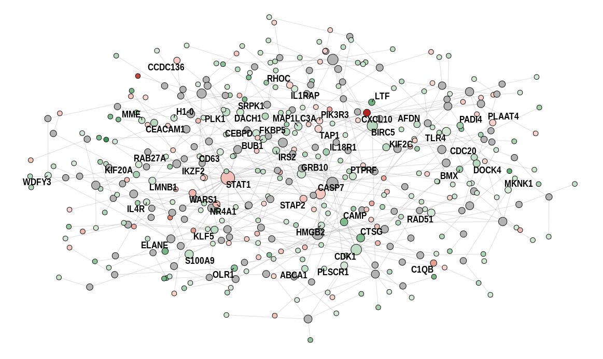

# networker: Reproducible PPI Network Creation and Visualization in R

A suite of functions to make it simple to construct PPI networks inside of R,
with an emphasis on usability and reproducibility.

## Installation
You can install `networker` with the following (assuming you have `devtools`
already installed):
```r
devtools::install_github("https://github.com/travis-m-blimkie/networker")
```

If you run into installation issues relating to the package `biomaRt` (which is
a dependency of `networker`), you can install it with the following:
```r
if (!require("BiocManager")) { # Optionally install BiocManager if needed
  install.packages("BiocManager")
}
BiocManager::install("biomaRt")
```

## Example
```r
> library(tidyverse)
# ── Attaching packages ────────────────────────────────── tidyverse 1.3.1 ──
# ✓ ggplot2 3.3.5     ✓ purrr   0.3.4
# ✓ tibble  3.1.6     ✓ dplyr   1.0.8
# ✓ tidyr   1.2.0     ✓ stringr 1.4.0
# ✓ readr   2.1.2     ✓ forcats 0.5.1
# ── Conflicts ───────────────────────────────────── tidyverse_conflicts() ──
# x dplyr::filter() masks stats::filter()
# x dplyr::lag()    masks stats::lag()

> library(networker)
# Thanks for using networker! If you encounter any bugs or problems, please 
# submit an issue at the Github page: 
# https://github.com/travis-m-blimkie/networker/issues

> ex_genes <- read_csv("ex_de_genes.csv")
> glimpse(ex_genes)
# Rows: 450
# Columns: 9
# $ ensembl_gene_id <chr> "ENSG00000002549", "ENSG00000003147", "ENSG000000053…
# $ hgnc_symbol     <chr> "LAP3", "ICA1", "MPO", "PDK2", "PGLYRP1", "MMP25", "…
# $ entrez_gene_id  <dbl> 51056, 3382, 4353, 5164, 8993, 64386, 51099, 54443, …
# $ baseMean        <dbl> 490.07793, 29.63805, 332.51245, 108.59034, 310.38400…
# $ log2FoldChange  <dbl> 0.7846097, -1.1009100, -1.8190114, 0.5872697, -1.261…
# $ lfcSE           <dbl> 0.2034562, 0.1816788, 0.3962989, 0.2040399, 0.248676…
# $ stat            <dbl> 3.856406, -6.059649, -4.589999, 2.878210, -5.074263,…
# $ pvalue          <dbl> 1.150662e-04, 1.364186e-09, 4.432490e-06, 3.999387e-…
# $ padj            <dbl> 3.143249e-03, 7.049566e-07, 3.556729e-04, 3.223212e-…

> ex_network <- build_network(
    df    = ex_genes,
    col   = "ensembl_gene_id",
    order = "min_steiner"
  )
# Finding interactions...
# Creating network...
# Performing 'Steiner' minimum network trimming...
# Done.

> plot_network(
    network      = ex_net,
    fill_column  = log2FoldChange,
    layout       = "force_atlas",
    label        = TRUE,
    label_column = hgnc_symbol,
    label_filter = 1
  )
# Calculating Force Atlas node positions...
# Warning message:
# Removed 364 rows containing missing values (geom_text_repel).
```



## Versioning
This package makes use of [SemVer](https://semver.org/).

## Authors
Travis Blimkie is the originator and principal contributor. You can check the
list of all contributors [here](https://github.com/travis-m-blimkie/networker/graphs/contributors).

## License
This project is written under the GPLv3 license, available
[here.](https://github.com/travis-m-blimkie/networker/blob/main/LICENSE.md)
