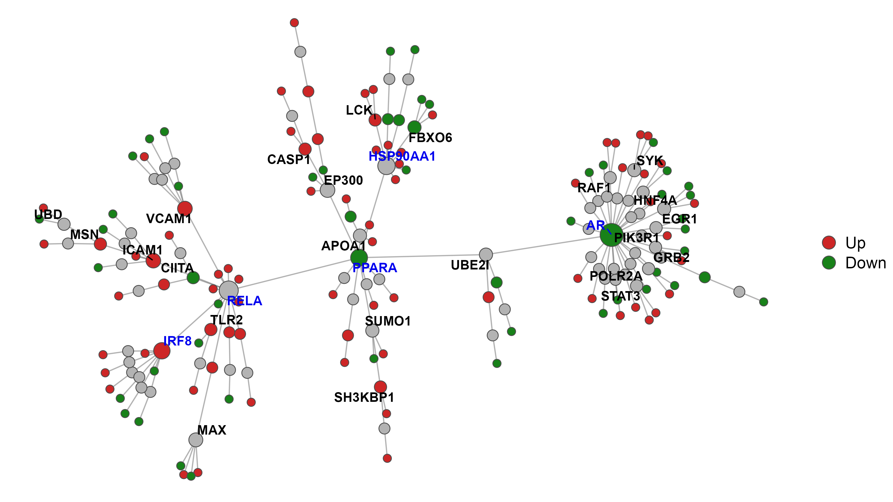
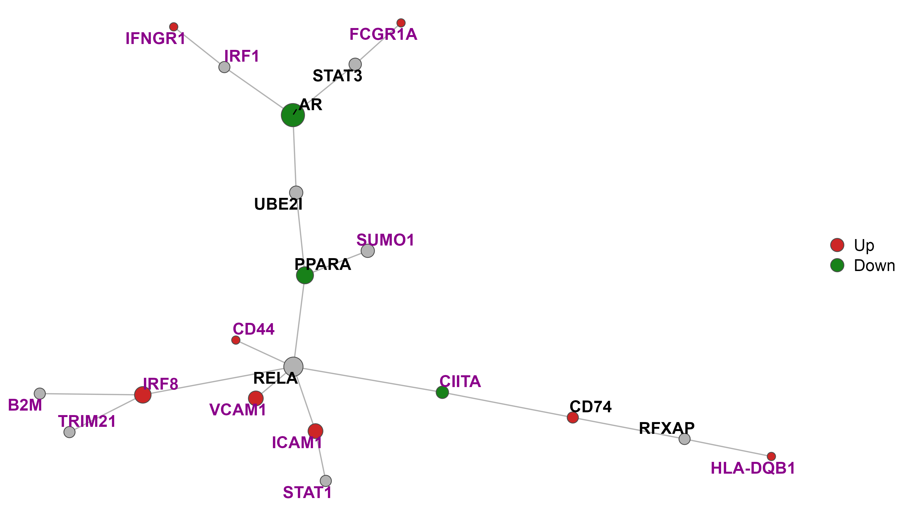

# networker: Reproducible PPI Network Creation and Visualization in R

A suite of functions to make it simple to construct PPI networks inside of R,
with an emphasis on usability and reproducibility.

## Installation
You can install `networker` with the following (assuming you have `devtools`
already installed):
```r
devtools::install_github("https://github.com/travis-m-blimkie/networker")
```

If you run into installation issues relating to the package `biomaRt` or `ReactomePA` (which are
dependencies of `networker`), you can install them with the following:
```r
if (!require("BiocManager")) { # Optionally install BiocManager if needed
  install.packages("BiocManager")
}
BiocManager::install("biomaRt", "ReactomePA")
```

## Example
Start off by loading the package, reading in some genes, and building a network
using the "min_steiner" option, which works well for most small- to mid-sized
networks.

```r
> library(networker)
# Thanks for using networker! If you encounter any bugs or problems, please 
# submit an issue at the Github page: 
# https://github.com/travis-m-blimkie/networker/issues

> ex_genes <- read_csv("ex_de_genes.csv")
> glimpse(ex_genes)
# Rows: 158
# Columns: 3
# $ ensembl_gene_id <chr> "ENSG00000160654", "ENSG00000018280", "ENSG00000179...
# $ hgnc_symbol     <chr> "CD3G", "SLC11A1", "CIITA", "EIF4E3", "RNASE6", "AL...
# $ log2FoldChange  <dbl> 0.07662557, 1.02935351, -2.59604031, -0.47667505, 2...

> ex_network <- build_network(
    df    = ex_genes,
    col   = "ensembl_gene_id",
    order = "min_steiner"
  )
# ==> INFO: Found 3 duplicate IDs in the input column, which have been removed:
# ENSG00000172724, ENSG00000169397, ENSG00000169385
# 
# Finding interactions...
# Creating network...
# Performing 'Steiner' minimum network trimming...
# Done.
```

Notice that duplicate IDs are automatically removed from the input, with a
message to the user. Now we can visualize the network with `plot_network`, using
the automatically added "gene_name" column to provide the labels:

```r
> plot_network(
    network      = ex_net,
    fill_column  = log2FoldChange,
    fill_type    = "fold_change",
    layout       = "force_atlas",
    label        = TRUE,
    label_column = gene_name,
    label_filter = 2,
    legend       = TRUE
  )
# Calculating Force Atlas node positions...
# Warning message:
# Removed 166 rows containing missing values (geom_text_repel).
```



We can then use the `enrich_network` to test for significantly enriched Reactome
pathways (implemented with
[ReactomePA](https://bioconductor.org/packages/ReactomePA/)):

```r
> (sig_pathways <- enrich_network(network = ex_net, filter = 0.05))
# # A tibble: 211 × 5
#    id            description                                          p_value   p_adjust gene_id
#    <chr>         <chr>                                                  <dbl>      <dbl> <chr>  
#  1 R-HSA-2029480 Fcgamma receptor (FCGR) dependent phagocytosis       2.15e-11    1.01e-8 695/74…
#  2 R-HSA-449147  Signaling by Interleukins                            2.22e-11    1.01e-8 3383/8…
#  3 R-HSA-2424491 DAP12 signaling                                      2.72e-10    8.16e-8 695/58…
#  4 R-HSA-1433557 Signaling by SCF-KIT                                 4.33e-10    8.16e-8 5879/5…
#  5 R-HSA-877300  Interferon gamma signaling                           6.24e-10    8.16e-8 3383/5…
#  6 R-HSA-9664407 Parasite infection                                   7.18e-10    8.16e-8 695/74…
#  7 R-HSA-9664417 Leishmania phagocytosis                              7.18e-10    8.16e-8 695/74…
#  8 R-HSA-9664422 FCGR3A-mediated phagocytosis                         7.18e-10    8.16e-8 695/74…
#  9 R-HSA-2029482 Regulation of actin dynamics for phagocytic cup ...  1.05e- 9    1.06e-7 695/74…
# 10 R-HSA-388841  Costimulation by the CD28 family                     4.13e- 9    3.75e-7 5879/5…
# # … with 201 more rows
```

Finally, we can pick one of the pathways output above, and pull out a
module/subnetwork based on the genes belonging to that pathway, which are 
highlighted when plotting:

```r
> ex_net_module <- extract_subnetwork(
    network       = ex_net,
    enrich_result = sig_pathways,
    pathway_name  = "Interferon gamma signaling"
  )

> plot_network(
    network      = ex_net_module,
    fill_column  = log2FoldChange,
    fill_type    = "fold_change",
    legend       = TRUE,
    layout       = "kk",
    label        = TRUE,
    label_column = gene_name,
    label_filter = 0,
    subnet       = TRUE
  )
# Detected this is a sub-network generated by `extract_subnetwork()`.
# Highlighted node labels indicate genes from the extracted pathway.
```



## Versioning
This package makes use of [SemVer](https://semver.org/).

## Authors
Travis Blimkie is the originator and principal contributor. You can check the
list of all contributors [here](https://github.com/travis-m-blimkie/networker/graphs/contributors).

## License
This project is written under the GPLv3 license, available
[here.](https://github.com/travis-m-blimkie/networker/blob/main/LICENSE.md)
